# Qigua Pro —传统决策手艺

> **基于《易经》64卦 +传统决策体系6 层模型的现代决策辅助工具**
> 让普通人也能像老江湖一样做决策：卦象看格局，六层模型看动作。

[](demo.svg)

##这是什么

把中国古代的决策智慧（易经 + 五行 +干支 +奇门 + 八门九星 + 三奇）包装成**任何人都能用**的 CLI工具 + AI 解卦 Prompt + Web UI。

- ❌ 不是算命
- ❌ 不是预测
- ✅ **是结构化思考工具**——帮你把模糊问题变成清晰决策

##3 分钟上手

### 选项 A：命令行（最快）

```bash
#1.装依赖
python --version # 需要3.10+
git --version

#2. Clone仓库
git clone https://github.com/yaofeng-huang/qigua-pro.git
cd qigua-pro

#3.跑第一卦
python qigua.py --time --question "下周该不该接那个5 万的订单？"
```

输出示例：

```
【问卦】下周该不该接那个5万订单?
本卦：革 ䷰（49/64） 模块6
关系：下克上 —内部能驾驭外部，主动出击
现代：革不是为变而变，是"水到渠成"
```

### 选项 B：Web UI（最友好）

```bash
pip install streamlit
streamlit run app.py
```

浏览器自动打开 http://localhost:8501

功能：
- 🪙 起卦（数字/时间/铜钱3 种方式）
- 📚6 层模型速查（每个模型有详细解释）
- 💼6 大场景案例（事业/家庭/教育/健康/财务/社交）
- ⚙️使用说明

### 选项 C：AI 直接解卦

把 CLI 输出贴给 ChatGPT / Claude / 通义千问 / Mavis，配上 `qigua_prompt.md` 作为 System Prompt，立刻得到**完整决策建议书**。

##6 层模型（决策核心）

| 层 | 看什么 |工具 |
|---|---|---|
|1️⃣ **阴阳遁** | 大节奏（攻/守） | 当前日期距夏至/冬至 |
|2️⃣ **月令旺衰** | 环境顺逆 | 当月五行 vs 你事的五行 |
|3️⃣ **爻位六神** | 主客关系 |动爻位置 + 时辰 |
|4️⃣ **用神** |关键抓手 |6爻中"最旺"的那一爻 |
|5️⃣ **八门九星** | 当下状态 | 时辰定八门，月份定九星 |
|6️⃣ **三奇** |机遇识别 |乙（隐性）/丙（显性）/ 丁（微调） |

##适用场景

- ✅创业0-1（选品、立项、找人）
- ✅业务增长期（拓客、招商、扩张）
- ✅业务低谷（裁员、转型、止损）
- ✅客户关系（建交、维护、决裂）
- ✅团队管理（招人、用人、淘汰）
- ✅资本动作（融资、股权、退出）
- ✅ 个人决策（跳槽、买房、重大谈判）

## 不适用场景

- ❌ 具体数字预测（中不中奖、赚多少）
- ❌情感安慰（他爱不爱我、复合不复合）
- ❌宿命论（我命里有没有 X）
- ❌ 求神问卦型问题

## 文件结构

```
qigua-pro/
├── README.md ← 你正在看的
├── LICENSE ← MIT License
├── app.py ← Streamlit Web UI
├── qigua.py ← CLI 起卦工具（数字/时间/铜钱三种）
├── gua_64.json ←64卦数据库
├── qigua_prompt.md ← AI 解卦 Prompt (v2.0)
├──知识库导览.md ← 两系统协同说明
├── 新会话使用手册.md ←30 秒上手指南
├── 发布指南.md ←两大市场发布步骤
├── demo.svg ← SVG伪动画演示
├──录屏脚本.py ← 真 GIF录制工具
└── .gitignore
```

##完整决策体系（可选）

如需6 层模型的完整速查表 +1688运营专项 + 生活场景应用，再 clone 上游仓库：

```bash
git clone https://gitee.com/yaofeng-huang/traditional-decision-kb.git
```

上游包含36 个文件：
-01-原文库（6 篇头条原文）
-03-决策体系（7 个速查手册）
-04-问卦系统（完整架构）
-05-场景应用（1688 +6 大生活场景）
-06-案例与日志
-99-工具脚本

##命理 vs 方法论（底线）

> **命理当民俗看，方法论当工具用**——这是底线。

- 五行/干支/奇门 — **方法论**（时-位-势-人四维决策模型）
- 八字/流年/吉日 — **民俗**（传统文化的趣味解读）

真正起作用的是**结构化思考过程**，不是卦象本身。

## 🪙 支持项目

完整版（Web UI + 6 层模型 + 决策书 + VIP 答疑）已上架爱发电：

### 👉 [afdian.com/a/hongyu13028](https://afdian.com/a/hongyu13028) **— ¥29.90/月**

**支持后立刻获得**：

- ✅ Streamlit **Web UI 完整功能**（可视化起卦 + 6 层模型速查 + 6 大场景案例）
- ✅ **6 层模型速查手册**（阴阳遁 / 月令旺衰 / 爻位六神 / 用神 / 八门九星 / 三奇）
- ✅ **决策书模板 + AI 解卦 Prompt v2.0**（双层并行）
- ✅ **1688 运营专项咨询**（月令节奏 + 大促择时 + 主客判断）
- ✅ **VIP 群答疑**（每月 1 次 1v1 咨询）

### 适用人群
- 1688 老板 / 中小创业者
- 重大决策前的"决策辅助"
- 感兴趣古文/易经的现代应用
- 打工人（¥29.9 = 一杯奶茶钱）

##升级路径

- **v1.0** —64卦框架 +6要素法
- **v2.0** —融入6 层模型 +决策书模板
- **v3.0** —6 个速查手册 +Web UI +6 大场景案例
- **v4.0（计划）** — 三奇占断完整化 +移动端

##反馈与社区

- 🐛 Bug /建议：GitHub Issues
- 💬讨论：Mavis Code社群
- 📧商务：email（待补充）

##致谢

基于：
- 《易经》64卦（公共领域）
-头条 @灿若星汉《我把《易经》64卦编成了人生通关攻略》
-头条 @周慎学八字 / @南山微头条 / @景边 / @人文谈 /奇门遁甲系列

现代解读部分归黄耀锋（黄总）原创。

---

**License**: MIT
**Author**: 黄耀锋 (yaofeng-huang)
**Version**: v3.0
**Created**:2026-06-10
